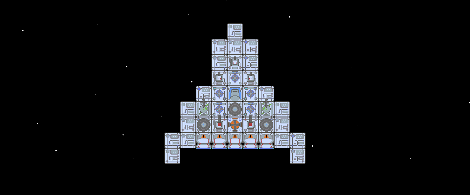
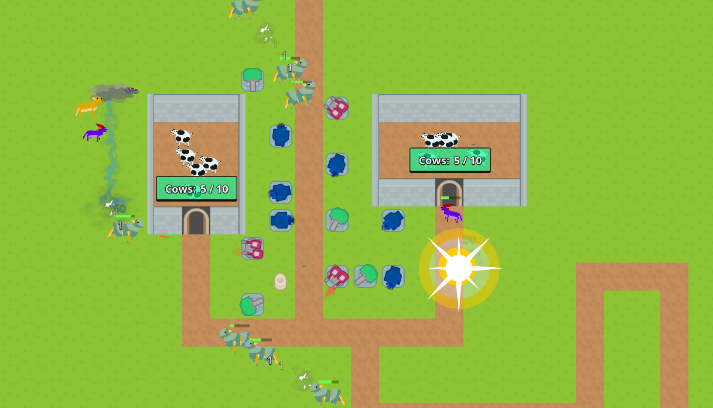
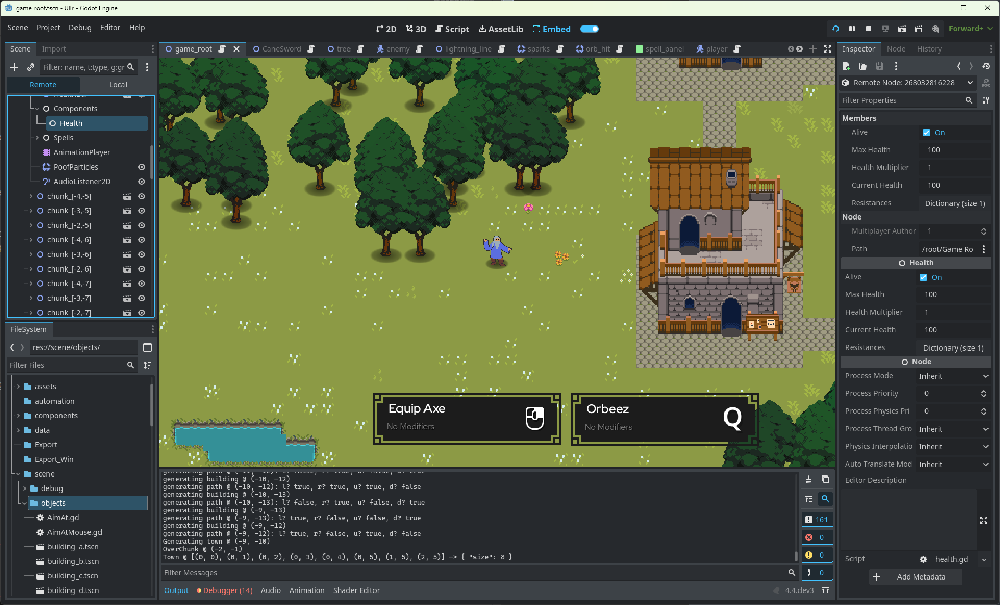
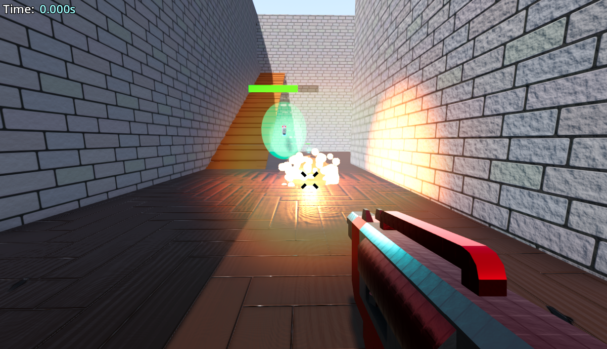
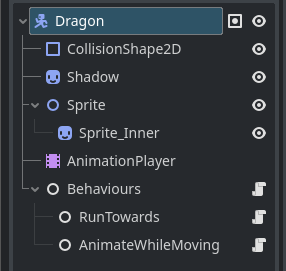
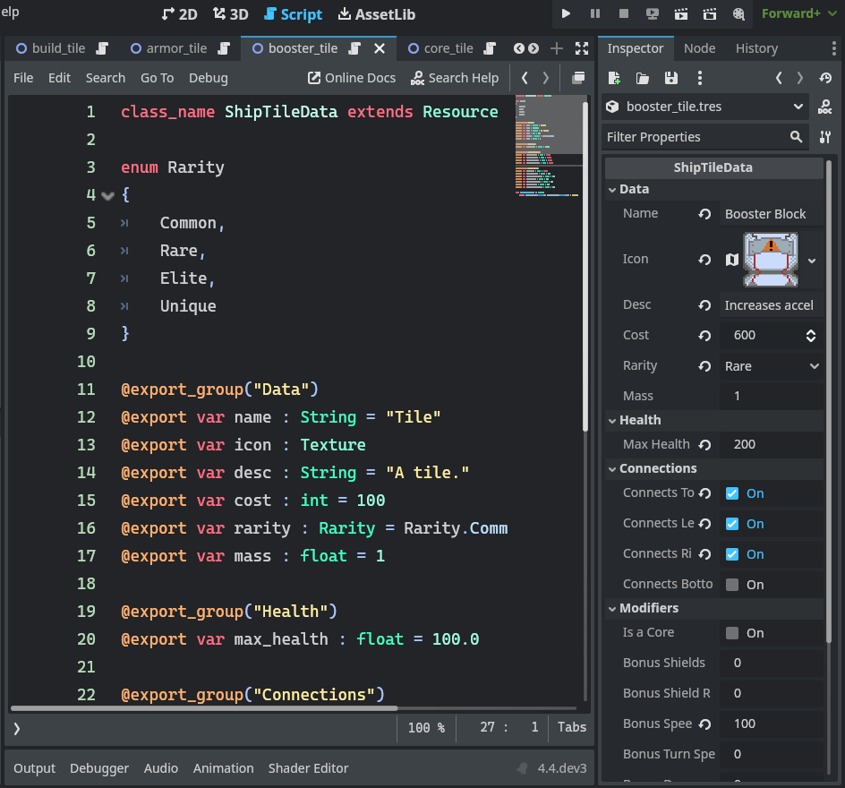

+++
title = 'GameJam Retrospective - GMTK 2024'
date = 2024-09-27T19:31:21Z
tags = ['gamedev', 'godot', 'game-jam']
series = ['gamejam']
+++

> In Murmurs of Awakening (MoA) you venture through space to hunt enemy ships, hoarding an arsenal of parts for your own ship. Only when you have amassed enough can you travel further into the reaches of space to take on bosses and acquire some extremely powerful rewards!

# Overview

## Play it!
MoA is available to play @ https://blambear.itch.io/murmurs-of-awakening

## Video


## The team and prep

This year's GMTK jam was slightly different from last year - lasting an extra two days! In lieu of that the resulting game was quite a bit more in-depth compared to last years submission, and this blog post will follow suit. Also this year we decided to not make a purposefully boring and tedious comedy-focused game!

I was on a team with two other people for the jam this year - the team consisted of a programmer (me), an artist (John) and a composer (Joe).

This was a nice step up from the [previous GMTK jam](../gmtk-game-jam-2023/) where it was just me and John. Having a third person was great for creativity, just being able to bounce ideas off two people instead of one was immensely helpful. It also unsurprisingly turns out that having bespoke and fitting music adds a lot to the end product, but I'll go more into that later.

I decided to do a little bit of prep for this year's game jam, making a small Tower Defence game and getting a feel for some of the bigger changes in Godot 4.3, such as the new `TileMapLayer` Node system, and built-in the physics interpolation, among others.

Note most of the assets here are from [KenneyNL](https://kenney.nl/), with the exception of my beautiful cows and foxes(?).

This was a great way to get into high gear, spending a few days beforehand just fiddling with a toy game with a small goal. I was able to test out quite a few Godot features I'd not really used before such as the pathfinding and tile-maps as well as refresh myself on animations, camera movement (panning, zooming), etc. I found this helped a lot when the jam started, even though I didn't really use any of these features in the actual jam game! Just being in the right mindset was helpful.

## Theme & Ideas
The theme for the GMTK 2024 was 'Built to Scale'.

We spent a while thinking about how to tackle this theme. At the start we were deliberating full game ideas, looking at various genres and contemplating how we could tie in the theme. This gave us a lot of ideas, all recorded in a spreadsheet used for collaboration (and later tracking), but nothing we came up with really jumped out at us. As time went on we changed tack, deciding to lean into thinking about what *mechanics* could work well with the theme, and then decide how to fit that into a game. This seemed to wake up our creativity, and led us to the main mechanic of the game we ended up making: picking up parts from your enemies to grow yourself.

This mechanic could be a part of a lot of different genres, and while I was rating games after the jam it was an idea used in quite a few games in various distinct ways. What we ended up deciding on initially was a bullet hell game with the idea being similar to the initial cellular stages of Spore, where you destroy enemies to grow and find bigger enemies, where you can see the enemies you defeated getting smaller giving you a great sense of scale. In the end the game went in a different direction, as you will find out below!

## Swapping to Godot
Last year's jam I used Unity, but I found myself getting frustrated at the slow iteration speeds - even for simple projects I was getting large recompile times. There are various people complaining online about this, and many workarounds that probably would help (such as disabling AV for your project files), but after suffering through this in the jam last year, I decided to try something else.  
This past year I've been tinkering about and prototyping various different games in Godot. It was a bit of a pain to start with, having to swap my mindset from Unity and picking up various different idioms along the way. One of the main pain points I had to start was that Godot 4.X doesn't support C# in web builds (currently it requires some changes on Microsoft's end to support .net as a WASM library, as opposed to the main app). This meant I had to go about learning and using GDScript, which to be honest was very trivial, but while it is quite nice to use in general I prefer using strongly typed languages. On this front I have been testing out using C++ as the main language for a game, which works fine, but it does reduce the main reason I swapped to Godot which is the very fast iteration times (although it can still be faster to recompile a GDExtension than a tiny Unity project somehow? oh dear..). Still - if I wanted to use Godot for a game jam, I'd have to get used to GDScript. It does have some decent type safety if you enable specific warnings in the editor, but it's still very run-time error prone, as opposed to compile-time for many type mismatch / typo issues.

Overall I do very much like using Godot, it has some very useful built-in features and functionality. I especially quite like how the UI nodes work (although I did dislike them at first: "why not just have padding and margins like HTML elements" I lambasted, and to be fair that would still be quite nice to have).

I've been slowly working on a roguelike action game:

I also tinkered with 3D games, making a high-movement FPS prototype, currently just a speed-running game but a useful base for any future FPS ideas:

And many many more! I've been having a blast this past year tinkering with Godot, both the games and the engine, to learn more about both game development and game engine development.

One major issue I've had with Godot are the bugs. I'll go over one specific bug that haunted me this game jam in a section below, but overall I seem to have been quite unlucky in my Godot journey, mostly stumbling across various annoying bugs that have made my question my sanity more than once. I know that this isn't a Godot exclusive issue, all engines have bugs of some kind, but I feel that the overall quality of admittedly more mature engines like Unity and Unreal is still a step ahead, especially when it comes to Godot 4, despite being quite mature now at .3 it's still not quite there in terms of stability (and if the rate of new features keeps up each release, it might take a while for it to settle down).

# The Game

## Final Concept
The initial idea was more of a classic shoot-em-up/bullet-hell style game. I decided to start by making the player ship, and as an experiment I wanted to see if it was possible for it to work as a [real physics object](https://docs.godotengine.org/en/stable/classes/class_rigidbody2d.html) as opposed to a script-controlled [CharacterBody](https://docs.godotengine.org/en/stable/classes/class_characterbody2d.html). We wanted it to be harder to avoid bullets the bigger you were, so either way we'd need to generate collision for the ship, so if it didn't work out I could just switch the type to a `CharacterBody2D` and I'd only need to change the movement code (to manually move the ship instead of applying forces to move the physics object). Adding an enemy ship was as easy as unchecking a `Is Player` checkbox, and we were up and running!

End of Day One:


In the end, after watching and discussing the result, we decided to stick with the physics-based approach. It made the game feel more.. spacey. It also added the possibility of new mechanics we excitedly discussed: ramming enemies, a gravity gun, explosions.. most of these didn't make it into the game, in fact only ramming did, but if we just had a little bit more time!

> Note: The placeholder textures used here, including everything but the starry background (just noise) are from [KenneyNL](https://kenney.nl/).

## Universe Creation
As we'd moved away from being bullet hell, we needed another method for spawning enemies and other physics objects. This lead to a few ideas, but the key being: You were exploring space to pillage parts from other ships and using them strengthen your ship. So, we needed a large world to play in. Knowing that the game would be made up of physics objects, and that we wanted a lot of various things like debris to interact with / avoid, I decided to start making a chunk-based universe system. This system would manage the loading/unloading, persistence, and randomisation. 

I'd never made any dynamic chunk based system before; I've only ever made a program to display minecraft chunks on an isometric map.This was quite a different challenge, there would be:
    - Movement, many objects drifting or flying between chunks
    - Modifications, the player will be destroying everything
    - Generation, as the player flies about the world should be generating around them

>  Note that the world generation mentioned in the roguelike prototype was done after this jam, using similar code and incorporating many of the tricks I found out during the jam!

I learned quite a lot about performance in Godot creating this system. It's important to keep in mind that the web export will be single-threaded, so chunk generation, loading and saving needed to be very performant to not cause any stuttering while the player flew about.

The key takeaways I found to stay performant in Godot are:
    - Don't add or remove too many nodes to the scene in one frame. This will cause significant stuttering. Any time a chunk was loaded, I would add it's children in batches every frame, I did a similar thing in reverse for unloading chunks. This smoothed out all of the stuttering issues I encountered when navigating between chunks.
    - Building up complicated scenes with many nodes will slow down your game, eventually. If you're going to be creating thousands of something, you'd be a lot better off not using Nodes and relying on the servers provided to perform actions such as physics queries. I rewrote the projectile system in the game from being the usual 1 projectile = 1 parent node with various child nodes for rendering, collisions, etc. Moving this to use a MultiMeshInstance2D for rendering, and use a buffer to keep track of all the projectiles, updating them all in a single GDScript loop and using the PhysicsServer to query for collisions, improved performance in situations with even just hundreds of projectiles.
    - RigidBody2Ds are actually quite performant. Maybe it's the characteristics of a game in space, where there are a lot of moving parts but not many collisions, but I could support quite a lot of asteroids on screen at once without having any performance degradation, even in web builds. I was surprised by how efficient this was.

While the second and third point are quite obvious, I was surprised at just how slow it could be to add a decent amount of Nodes to the tree at once. One thing I never quite fixed is that just loading in a large enough ship can cause a stutter, because I hadn't implemented anyway to add a ship's children (all of the blocks) piecemeal.

## Bosses and Upgraded Parts
One thing we really wanted to make sure we had in the game were some kind of boss battle, as a challenge for when you had built your ship up to a decent state. We wanted there to also be a good incentive to kill the bosses, so we added upgraded, quite OP, blocks that you could gain only by pilfering them from bosses. This wasn't explained to the player, but by virtue of how the game works you need to fight ships to gain their blocks, so you can see that a ship has a particularly powerful block.. especially if they fill the screen with green lasers.

I ended up creating a save file with all the possible blocks in the game, so that John could work on building the boss ships once he'd done most of the art we needed. I'd haphazardly made some easy/medium/hard ships earlier which were quite basic but contained each of the different types of blocks, such as hard ships containing shield blocks and homing lasers which would be very important for surviving and killing bosses.

## Web Build Leak - Panic!
I decided to use Godot 4.3, which had released less than a week prior to the jam starting, to create this game. This could be seen as a bad decision, but it was a stable release and had been tested with various beta and dev releases for a while, so it *should've* been quite stable..

I touched on major bugs in Godot earlier being a source of pain, but one hit particularly hard during the game jam. One of the reasons I wanted to use 4.3 was the change to support single threaded web builds which allowed for better embedding support on [Itch](https://itch.io). Without this enabled, Itch would pop-out the game window to allow for the SharedArrayBuffer support (which requires [cross origin isolation](https://developer.mozilla.org/en-US/docs/Web/HTTP/Headers/Cross-Origin-Embedder-Policy) due to various Spectre/Meltdown vulnerabilities). It also enabled web builds to work properly on MacOS devices.

When play-testing the game on the Monday, after 10 minutes or so the game would always freeze. Initially I thought the chunk system may not be working, or that the large pngs might be causing some issues with WebGL. I got my fellow team members to try out and see if it happened to them, trying different browsers, seeing if it was consistent at all, etc. I'd been writing various systems to manage the world generation, chunking, etc. and figured I was messing up somewhere, so I tried fiddling with various parameters to dial down the amount of objects in the game: fewer enemies, fewer asteroids, smaller textures, removing animations, longer time between shots, etc. but nothing really helped - it might make the game take longer to crash but it would always eventually crash. This was incredibly frustrating, and Googling around the issue and asking about in Discord wasn't proving very insightful. One of the main problems I was having is that it's quite hard to get insight into the web builds, the remote view and debugger seemingly didn't want to work with the web builds, so I couldn't directly view what was happening. I ended up creating a screen to view the metrics I thought could be a problem: Node Count, Resource Count and Orphaned Node Code.

Mostly everything in Godot revolves around Nodes. The standard archetype is to use Nodes in a tree structure to create your scenes (prefabs), you can even use them to create component or behaviour systems:

Orphaned Nodes are nodes that aren't anywhere in the current scene tree, but haven't been freed. There are reasons you might want to keep orphaned nodes around, such as a cache or some kind of Node pooling. I was keeping some orphaned nodes about: keeping chunks in memory instead of reloading them as some kind of attempt to improve performance (at the expense of memory). I disabled this, but to no avail.

Resources are the way to organise data in Godot. I used resources throughout MoA:

While resources can be shared, for example all the Booster Blocks will use the same ShipTileData resource (`booster_tile.tres` as per the screenshot), resources can also be created and unique per scene or node instance. This means it's possible to leak resources if handled improperly. The `Resource` type inherits from `RefCounted`, so in theory shouldn't leak, but if you're accidentally keeping references to them open in some way you can see them, although this would likely be a side-effect of other leaks (such as leaking Orphaned Nodes which are holding references to the resources).

None of the metrics for Nodes, Orphaned Nodes or Resources were showing any kind of noticeable leak. Numbers would go up and down as you flew about the world, generating new chunks, destroying enemies, and so on, but the numbers were stable in both web and Windows builds. Reasoning that something must be going wrong elsewhere I still can't see, I decided to show more metrics, this time adding everything possible (why didn't I do this at the start?). This then showed the problem: Objects were leaking.

`Object` is the base class for all other classes in Godot: `Node`, `RefCounted` (which `Resource` then inherits from), the various Servers such as DisplayServer and PhysicsServer, etc. By themselves they need to be manually freed, although RefCounted adds automatic reference counting to the `Object` base type. The problem with having an `Object` leak is that without actual memory tracking (such as taking heap snapshots) it's very hard to find the objects being allocated. I couldn't just walk the scene tree and find all the objects referenced, because even if they aren't being referenced by anything they may not have been freed. I decided to mostly cut my losses here, and see if I could reproduce the issue on earlier Godot builds. I cloned the repo and tried downgrading it to 4.2, which required a bit of poking about to get running, and it didn't exhibit the same issues. Unfortunately 4.2 doesn't have native 2D physics interpolation, which made the game feel a lot better on higher refresh rate screens (and alternatives such as the great [Smoother extension](https://godotengine.org/asset-library/asset/1585) don't support interpolation of rigid bodies of which basically the entire game is comprised of). It would also mean going back to worse web support, which isn't ideal for a game jam where you want as many people as possible to play and vote on your game. In a stroke of desperation, I decided to try the 4.3 beta releases. I had 4.3.beta2 on my machine already, but it showed the same object leak issue. I then downloaded 4.3.beta1 which was the earliest I could try that included the web changes I wanted. Luckily this version didn't show any leaks! I left the game running in the browser for the rest of the day to make sure that it wasn't having any issues, and decided for then to move on as I'd wasted a fair bit of time trying to get the game not to crash, and I was running out of time to get the game into a good state for submission the next day.

A few days after the jam I decided to investigate this issue, no one I'd talked with in the discord seemed aware of any reported leak behaviour so I figured it was my duty to uncover the bug so it could be fixed quickly. The improved web builds were a big selling point of 4.3 and as it stood this seemed like a major blocker for adoption. I was fairly quickly able to find the source of the leak, now that the pressure of the jam had gone my mind had cleared up a bit. I'd had a look at the major changes between 4.3.beta1 and 4.3.beta2 and decided that a likely cause of the issue would be audio. Being a major proponent of creating quick hacks to test a theory, I commented out every audio source `.play` call. This immediately stopped the leaked objects from being created! It also came with the benefit of *significantly* increasing performance, it turns out I was creating a lot of audio: Each ship had multiple blocks that made noises (lasers, launchers), and then you could boost the fire rate of all blocks significantly, leading to sometimes hundreds of noises being played per frame - oops! This was one of the biggest factors that caused the game to slow down significantly when fighting bosses or when your own ship became very large.

One of the major areas in making Godot 4 work in single-threaded mode was the audio engine, 4.3 added in a whole new type of audio playback and touched almost all of the web audio playback code. Large changes like this, while tested thoroughly in the various dev releases, are always going to have the potential for latent bugs. As it turns out, these changes introduced a major issue: Playing audio would create `Object`s that would never be released. This, in WASM world, would cause an eventual crash when the game engine tried to create a buffer larger than the spec allows. This meant that any Godot 4.3 game on the web would *eventually* crash. You can read more about the issue I raised about it here: [Issue 96068](https://github.com/godotengine/godot/issues/96068).

Luckily this was quickly fixed, and is in 4.4.dev2+, it should also be included in 4.3.1.
I have yet to update the version of MoA on itch.io, I am waiting for a stable version of Godot with this fix in it to publish the many performance and balance improvements I've made since the jam.

## Dynamic Music
One of the features we knew we wanted was dynamic music. Joe had been dutifully working away, creating music with varying intensities that we could swap between. I knew that 4.3 had implemented some extra audio features, but I hadn't made any time to play around with them (did I mention it released only days before the game jam?). Unfortunately this made the dynamic music a bit more involved than it needed to be, but only just.

There were four distinct play states we could be in:
    - Building your ship
    - In space, no enemies near
    - In space, under attack from at least one enemy ship
    - In space, under attack from a boss ship

The ship builder had it's own music, re-using the main menu music. That was very straightforward.

For the different states of being under attack, we went from a basic song with few elements, to an involved and beautiful and intense track. One of my main regrets with the game as released for the jam is that the full boss music just wasn't played that often, for various reasons such as sparsity, and how quickly boss fights tended to end (one way or the other). Post-jam I've tweaked this so that any in-space music will play for at least 5 seconds, as well as making the battles last generally longer, this means you can actually hear the boss music!

It turns out, it's pretty simple to just have effectively a "ring buffer" of `AudioStream` nodes that you can then fade in and out using tweens on the volume, and cycling between. Obviously it'd be much better to use the new features such as an `AudioStreamPlaylist`, but as it stands the solution quickly hacked together on deadline day worked out quite well.

## Play-testing and Finishing Touches
One of the most important lessons learned from the jam was just how critical it is to get feedback from outside the group during a jam. This, again, seems like a fairly obvious thing to state, but it can't be understated! We had a few people play-test the game and give instant feedback in a call, trying to avoid pushing the play-tester in any specific direction or helping them at all. It's very easy to overlook very basic things when you're nearing the end of a 4 day game jam! We had some very basic issues, such as it being hard to find nearby enemies (so we made the radar arrows scale to show distance), or that it was very annoying to go back to the station to rebuild (so we made it so you could enter build mode from anywhere), and that it was hard to tell when you were moving in empty space (so I finally got around to fixing the background so it scrolled as I'd envisioned on day one).  
There were many other very basic things, around UX, balancing, bugs, etc. and I managed to fix *most* issues before we submitted. The difference in quality from pre to post play-test feedback was insane.

## Post-Jam Thoughts
We came in at 1322/7606 overall, and 460/7606 for enjoyment. These numbers represent a significant improvement from last year! We also got [quite a few comments](https://itch.io/jam/gmtk-2024/rate/2903509) from people who happened to really enjoy the game and the overall concept. There was some nice feedback, but overall the responses were very positive which is great!

I think the main failing of the concept in a game-jam is that it is a slow start. Now this was the case for many games, considering the theme was "built to scale" - many games went the route of power-scaling which tends to lean toward games being more fun the more you play. This doesn't work out great for a gamejam where people likely won't spend all too much time playing your game before moving on. You need a real hook, or you need the players to really buy into the concept (which we did quite well with for some people at least, considering the sentiments in the comments).
