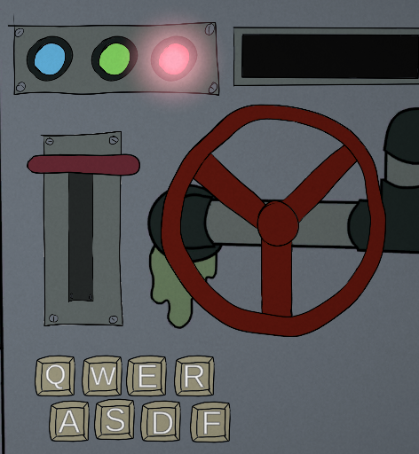
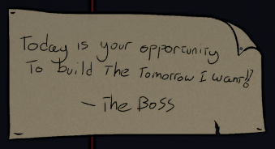

+++
title = 'Gamejam - GMTK 2023'
date = 2023-07-08T15:50:41Z
tags = ['gamedev', 'unity', 'game-jam']
series = ['gamejam']
+++

# Overview

## Play it!
The game is available to play @ https://blambear.itch.io/cookie-factory-online

## Team
I participated in this GameJam with one other team member, John, who was responsible for the art. I focused on the programming, and we both shared responsibility for ideas and design. All of the art and code was created just for this gamejam, and the sounds were all free to use assets.

## Theme
The theme for the GMTK 2023 was 'Roles Reversed'.

We decided to create our game around a factory worker making singular cookies using a very complex machine. This was our attempt at reversing the role in an idle game (with heavy inspiration from [Cookie Clicker](https://orteil.dashnet.org/cookieclicker/)).

# The Game
The easiest way to understand the game is to watch the demo video (or [play it yourself](https://blambear.itch.io/cookie-factory-online)!)


The game is somewhat of a rhythm game, although you end up creating your own rhythm. You have to perform actions in a set order to create cookies for the day, there are 5 days (1 work week!) worth of recipes that get progressively more difficult to follow:  

There are 6 different actions: 3 buttons (click), one lever (grab and flip up & down), and one valve (grab & spin). The last option is a keyboard key (q,w,e,r - a,s,d,f). The current action glows so that you can learn the recipe as you go instead of remembering every action, in the screenshot below you can see that the red button is glowing meaning it's the next action the user should perform.
This creates a situation where you can type in the required keyboard actions with one hand, and control the other actions with the mouse.

You also periodically get interrupted and need to type in specific words. This provides a small bit of randomness and also makes it harder in the sense that you may want to type with *both* hands to type the word quicker, especially if it's one of the longer ones, but that then means you have to re-settle your hand back on the mouse. It can completely kill your flow!

The overall goal of the game is to produce a set amount of cookies within a time limit, you are not told this beforehand and are judged severely if you underperform! The game makes use of humour (mostly parodying a sweatshop) to keep the player interested and engaged, as the gameplay is very repetitive and quite tedious by design (we may have gone too far with the tedium!). The game can't realistically be won or lost, even if you meet your quota every day for the week you're laid off 😔.

## Source

The C# sourcecode is available under MIT license on github:
https://github.com/blam23/gmtk-2023-cookie-factory-src

The art assets & unity project currently aren't available to download.
